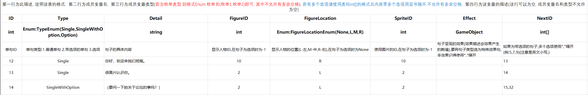
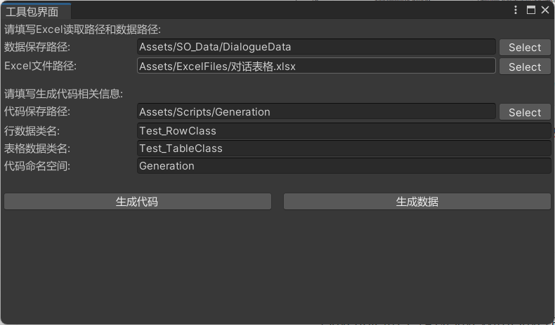
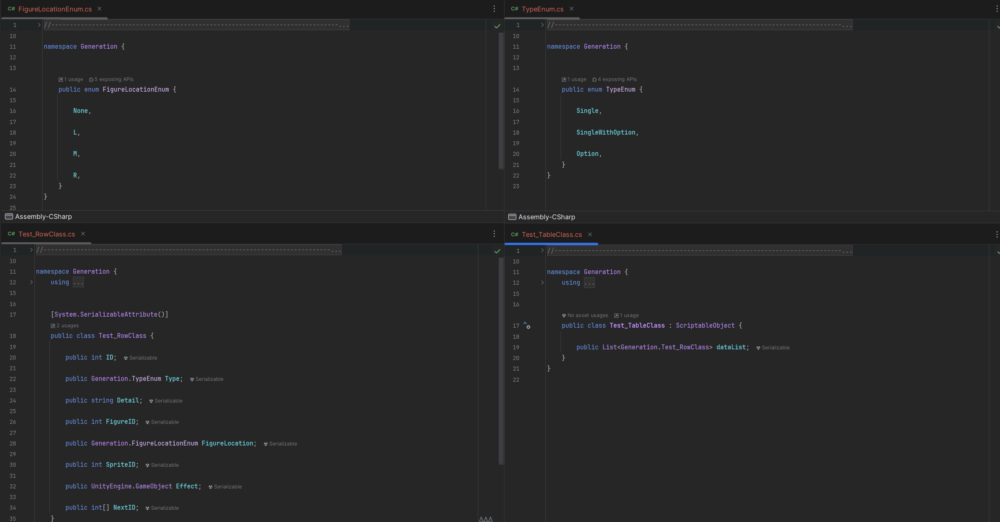
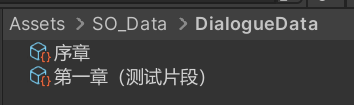
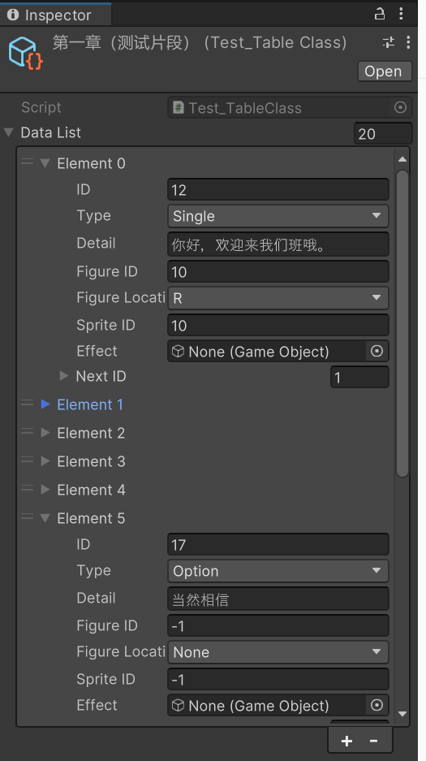
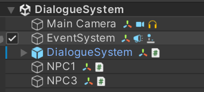
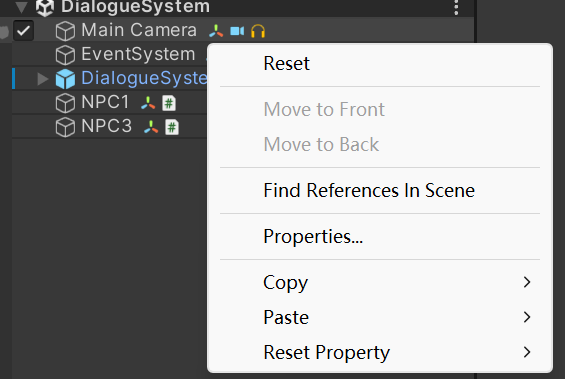

# 说明文档

[TOC]

## (一) 代码生成器

### 1. 兼容性设置

代码生成是基于System.CodeDom库编写的, 此库对兼容性有一些要求, 如果导入后Unity报错, 可以在Project Settings里修改项目框架兼容性, 具体如下:

Edit -> Project Settings -> Player -> Other Settings -> Api Compatibility Level, 将此选项改为.NET Framework即可

### 2. API介绍

```c#
// 用于表示成员变量相关信息的结构体
public struct MemberStruct
{
    public readonly string MemberType;	// 成员变量类型
    public readonly string MemberName;	// 成员变量名
    public readonly bool IsPublic;	// 是否为公有属性

    // 有参构造函数
    public MemberStruct(string memberType, string memberName, bool isPublic = true)
    {
        MemberName = memberName;
        MemberType = memberType;
        IsPublic = isPublic;
    }
}
```

```c#
public static void CreateClass(string className,	// 类名
                               List<MemberStruct> members,	// 类成员变量列表
                               string savePathFolder = "Assets/Scripts/Generation", // 代码保存文件夹(不包括类名)
            				   string classNamespace = "DefaultNameSpace",	// 代码命名空间
                               string baseClassName = null,	// 基类(为null表示不继承)
                               List<string> reference = null,	// using引用目录,默认含有System和UnityEngine和System.Collections.Generic
                               bool serializable = false) // 是否添加标签[System.Serializable]
```

```c#
public static void CreateEnum(string enumName,	// 类名
                              List<string> enumMembers,	// 枚举成员列表
                              string savePathFolder = "Assets/Scripts/Generation",	// 代码保存文件夹(不包括枚举类名)
            				  string enumNamespace = "DefaultNameSpace")	// 代码命名空间
```

### 3. 具体使用案例

```c#
public class Example
{
    // 生成枚举代码
    public static void TestGenerateEnum()
    {
        var members = new List<string>
        {
            "Test1",
            "Test2",
            "Test3"
        };
        CodeGenerator.CreateEnum("TestEnum", members, "Assets/Scripts/Generation", typeof(Example).Namespace);
    }
     
    // 生成类代码
    public static void TestGenerateClass()
        {
            // 生成代码
            var members = new List<MemberStruct>
            {
                new("int", "TestInt"),
                new("string", "TestString"),
                new("float", "TestFloat"),
                new ("int[]", "TestIntArray"),
                new ($"{typeof(Example).Namespace}.TestEnum", "TestEnum"),
            };
            CodeGenerator.CreateClass("TestClass", members, "Assets/Scripts/Generation",typeof(Example).Namespace, "MonoBehaviour");
        }
}
```


## (二) Excel工具包

### 1. 对Excel表的格式要求

- 第一行为表格描述
- 第二行为成员变量名
- 第三行为成员变量类型(若为枚举类型,则格式Enum:枚举名(枚举1,枚举2)即可, 其中不允许有多余空格), 若有多个选项请使用类似int[]的格式且内容里多个选项用逗号隔开,不允许有多余空格
- 第四行为该变量的描述(该行可以为空, 成员变量名和类型不允许为空)

举例说明:



### 2. 使用方法

```c#
[MenuItem("Lyf/ExcelKit/工具包界面")]
```

在编辑器窗口上方菜单栏中选择Lyf栏的ExcelKit的工具包界面, 将会弹出一个设置界面



设置好相关信息后点击生成代码, 会自动生成该表对应的枚举类, 行类(保存一行数据的类)以及表类(保存整个表数据的类), 以该默认设置数据和上述Excel表为例, 会在Asset/Scripts/Generation文件夹中生成两个枚举类,一个行类,一个表类:



生成代码文件后, 点击生成数据按钮, 会在指定路径下生成对应的ScriptableObject数据文件(具体类型为生成的表类), 每个数据文件对应Excel文件中的一个Sheet, 名字也一一对应:  


生成代码时会生成一个对应的函数, 若你删除了生成的代码文件后出现报错, 可以在ExcelKit目录中点击"恢复被修改的代码文件"按钮来还原为初始函数避免报错


## (三) 存档系统

### 1.存档模式接口

- ISaveable接口, 作为ISaveWithPlayerPrefabs和ISaveWithJson的基类接口

  ```C#
  public interface ISaveable { }
  ```

- ISaveWithPlayerPrefabs接口, 如果你希望使用Unity提供的PlayerPrefabs的来存档,使需要保存的数据继承这个接口即可

  ```C#
  public interface ISaveWithPlayerPrefs : ISaveable
  {
      string SAVE_KEY { get; }	// 保存的键
      void SaveWithPlayerPrefs();
      void LoadWithPlayerPrefs();
  }
  ```

  

- ISaveWithJson接口, 如果你希望使用Json文件来存档,使需要保存的数据继承这个接口即可

  ```C#
  public interface ISaveWithJson : ISaveable
  {
      string SAVE_FILE_NAME { get; }	// 存档文件名
      void SaveWithJson();
      void LoadWithJson();
  }
  ```

  

- 枚举类,用于标记保存方法

  ```C#
  public enum SaveType
  {
      PlayerPrefabs,
      Json
  }
  ```

### 2.存档系统使用

在SaveManager.cs中实现了对Object的泛型Save和Load静态方法,分别对应PlayerPrefabs和Json两种实现, 该存档系统的Json序列化基于Newtonsoft.Json库实现,支持对List和Dictionary的序列化和反序列化,同样支持自定义类型序列化方法和反序列化方法.

SaveManager定义:

```C#
public class SaveManager : GlobalSingleton<SaveManager> // GlobalSingleton是场景内全局泛型单例类(详见后续的单例系统介绍)
```

- Use PLayerPrefabs

| 方法名                                                       | 参数表述                                  | 作用                           |
| ------------------------------------------------------------ | ----------------------------------------- | ------------------------------ |
| public static void **SaveWithPlayerPrefs**(string key, object data) | key: 存储关键字<br />data: 保存的数据对象 | 以PlayerPrefs方式保存data      |
| public static T **LoadWithPlayerPrefs**<T>(string key)       | key: 存储关键字                           | 从PlayerPrefabs读取key对应数据 |

- Use Json

| 方法名                                                       | 参数描述                                | 作用                         |
| ------------------------------------------------------------ | --------------------------------------- | ---------------------------- |
| public static void **SaveWithJson**(string saveFileName, object data) | saveFileName: 存档名<br />data:保存数据 | 以Json文件的方式保存data     |
| public static T **LoadWithJson**<T>(string saveFileName)     | saveFileName: 保存文件名                | 通过指定文件json名来加载data |
| public static void **DeleteSaveFile**(string saveFileName)   | 保存文件路径                            | 删除对应路径的文件           |

同样提供了注册和注销需要保存和加载数据的方法, ***非静态方法,需要通过单例来调用***

- Register and UnRegister

| 方法名                                                       | 参数                                     | 作用                                   |
| ------------------------------------------------------------ | ---------------------------------------- | -------------------------------------- |
| public void **Register**(ISaveable saveable, SaveType type)  | saveable:注册对象<br />SaveType:注册类型 | 将注册对象注册到<br />对应的注册队列中 |
| public void **UnRegister**(ISaveable saveable, SaveType type) | saveable:注册对象<br />SaveType:注册类型 | 将注册对象从对应的<br />注册队列中注销 |

提供对注册到SaveManager的对象进行统一的保存和加载,***非静态方法,需要通过单例来调用***

| 方法名                                             | 参数              | 作用                     |
| -------------------------------------------------- | ----------------- | ------------------------ |
| public void **SaveAllRegister**(SaveType saveType) | saveType:保存类型 | 保存全部的注册的对象信息 |
| public void **LoadAllRegister**(SaveType saveType) | saveType:保存类型 | 加载全部的注册的对象信息 |


#### 具体使用案例

创建一个PlayerData类(或结构体)作为当前需要保存的信息类

```C#
[Serializable]
public class PlayerData
{
    public string playName;
    public List<int> playerList;    // 测试List是否可以序列化(分别为Level, Score)
    public Dictionary<string, Vector3> PlayerDict;  // 测试Dictionary是否可以序列化
}
```

创建一个Player继承ISaveWithJson, ISaveWithPlayerPrefs,实现对应的方法

- 当前类的属性


- 对应接口的实现方法,即设置需要保存和加载的信息, 使用SaveManager提供的函数接口来保存对应数据

  - ISaveWithPlayerPrefabs

  ```C#
  public string SAVE_KEY => "PlayerData";
  
  public void SaveWithPlayerPrefs()
  {
      var saveData = new PlayerData()
      {
          playName = playName,
          playerList = new List<int> {level, score},
          PlayerDict = new Dictionary<string, Vector3>
          {
              {playName, transform.position}
          }
      };
      SaveManager.SaveWithPlayerPrefs(SAVE_KEY, saveData);
  }
  
  public void LoadWithPlayerPrefs()
  {
      var saveData = SaveManager.LoadWithPlayerPrefs<PlayerData>(SAVE_KEY);
      playName = saveData.playName;
      level = saveData.playerList[0];
      score = saveData.playerList[1];
      transform.position = saveData.PlayerDict[playName];
  }
  ```
  
  - ISaveWithJson
  
  ```C#
  public string SAVE_FILE_NAME => "PlayerData.json";
  
  public void SaveWithJson()
  {
      var saveData = new PlayerData
      {
          playName = playName,
          playerList = new List<int> {level, score},
          PlayerDict = new Dictionary<string, Vector3>
          {
              {playName, transform.position}
          }
      };
      SaveManager.SaveWithJson(SAVE_FILE_NAME, saveData);
  }
  
  public void LoadWithJson()
  {
      var saveData = SaveManager.LoadWithJson<PlayerData>(SAVE_FILE_NAME);
      playName = saveData.playName;
      level = saveData.playerList[0];
      score = saveData.playerList[1];
      transform.position = saveData.PlayerDict[playName];
  }
  ```

实现这些接口方法后即可使用SaveManager提供的Save和Load方法来一键保存和加载数据了

```C#
private void Start()
{
    SaveManager.Instance.Register(this, SaveType.Json);
}

public void SaveData()
{
    SaveManager.Save(this, SaveType.Json);
    // 或者 SaveManager.Save(this, SaveType.PlayerPrefs);
    // 或者SaveManager.Instance.SaveAllRegister(SaveType.Json); (如果注册过)
}

public void LoadData()
{
    SaveManager.Load(this, SaveType.Json);
    // 或者SaveManager.Load(this, SaveType.PlayerPrefs);
    // 或者SaveManager.Instance.LoadAllRegister(SaveType.Json); (如果注册过)
}

private void OnDestroy()
{
    SaveManager.Instance.UnRegister(this, SaveType.Json);
}
```


## (四) 单例系统

| 名称            | 类型      | 作用                                         |
| --------------- | --------- | -------------------------------------------- |
| ISingleton      | interface | 标识单例类                                   |
| Singleton       | class     | 泛型通用单例                                 |
| SceneSingleton  | class     | 场景内单例,继承MonoBehavior,切换场景后会销毁 |
| GlobalSingleton | class     | 全局单例,继承MonoBehavior,切换场景不会销毁   |


## (五) 对象池系统

1. 通用单例模式,无需挂载到GameObject上,使用ObjectPool.Instance来获取单例

2. 扩容方式为:初始化容量为10, 后续采用以5为递增的扩容方式

3. 对外提供如下方法

| 提供方法                                                     | 描述                                                         |
| ------------------------------------------------------------ | ------------------------------------------------------------ |
| public void **SetInitialPoolCount**(int count)               | 设置对象池初始化时的容量                                     |
| public void **SetAddCount**(int count)                       | 设置对象池扩容时的扩容大小                                   |
| public GameObject **Allocate** (GameObject prefab, Action<GameObject> callback = null) | 从对应的对象池拿出对象并返回, callback为拿出对象后的回调函数 |
| public void **Recycle**  (GameObject prefab)                 | 将对象回收到对应的对象池中                                   |
| public void **ExpandPool** (GameObject prefab)               | 扩容已经存在的指定的对象池                                   |
| public void **ClearPool** (string prefabName, bool containActive = false) | 清空指定对象池中的对象, containActive为true时会销毁当前处于激活状态的对象 |
| public void **ClearPool**(GameObject prefab, bool containActive = false) | 清空指定对象池中的对象, containActive为true时会销毁当前处于激活状态的对象 |
| public void **ClearAllPool**  (bool containActive = false)   | 清空所有对象池中的对象,containActive为true时会销毁当前处于激活状态的对象 |


4. 具体案例: 

   ```c#
   public class Example : MonoBehaviour
   {
       public GameObject[] prefabs;
       private void Update()
       {
           // 按A生成一个Cube
           if (Input.GetKeyDown(KeyCode.A))
           {
               var cube = ObjectPool.Instance.Allocate(prefabs[0], obj =>
               {
                   // Cube设置为左上角
                   obj.transform.position = new Vector3(-7, 3, 0);
                   obj.transform.SetParent(transform);
               });
           }
           // 按B生成一个Sphere
           if (Input.GetKeyDown(KeyCode.B))
           {
               var sphere = ObjectPool.Instance.Allocate(prefabs[1], obj =>
   			{
   				// Sphere设置为右上角
   				obj.transform.position = new Vector3(7, 3, 0);
   			});
           }
           // 按C生成一个Capsule
           if (Input.GetKeyDown(KeyCode.C))
           {
               var capsule = ObjectPool.Instance.Allocate(prefabs[2], obj =>
   			{
   				// Capsule设置为中心
   				obj.transform.position = new Vector3(0, 0, 0);
   			});
           }
   
           // 按D回收全部Cube(不包括已经激活)
           if (Input.GetKeyDown(KeyCode.D))
           {
               ObjectPool.Instance.ClearPool(prefabs[0]);
           }
   
           // 按E收回所有Sphere(包括已经激活)
           if (Input.GetKeyDown(KeyCode.E))
           {
               ObjectPool.Instance.ClearPool(prefabs[1], true);
           }
   
           // 按F回收全部对象(包括已经激活)
           if (Input.GetKeyDown(KeyCode.F))
           {
               ObjectPool.Instance.ClearAllPool(true);
           }
       }
   }
   ```

5. 在场景中创建的对象池系统层级结构如下: ParentPool为对象池父物体(自动生成), 为每类对象提供单独的对象池(自动创建),名为"${prefabs.name} + Pool"

   

## (六) Hierarchy窗口美化包

导入Lyf/Utils/Editor文件夹后会自动生效,在Hierarchy窗口会显示该GameObject挂载的组件, 效果如下: 

点击对应的图标可以直接进行更改:  

