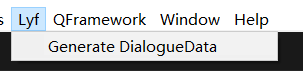
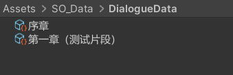
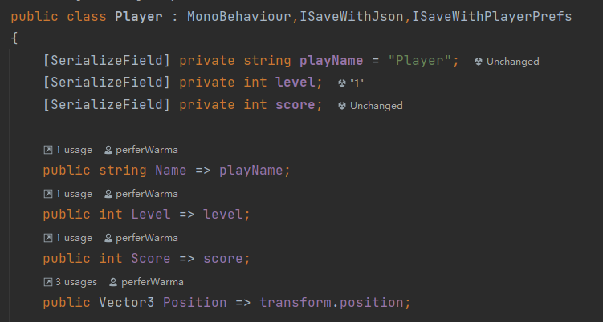
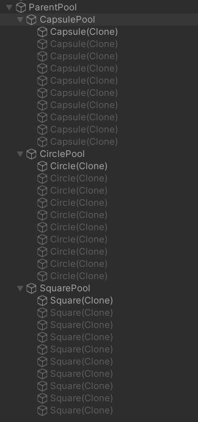

# 说明文档

[TOC]

## (一) 对话系统

### 1.数据生成

该dialogue system提供了数据生成的快捷脚本DialogueDataGenerate.cs

***【注】使用该脚本需要使用.NET第三方库ExcelDataReader和ExcelDataReader.DataSet***

 在Unity中点击Lyf下的“Generate DialogueData”选项



在确定你的生成路径保存数据和Excel文件读取路径后，点击生成数据按钮即可


对话数据会以ScriptableObject的形式保存, 数据文件名即为Excel对应的sheet名



### 2.对话系统使用

对话系统的主要组成如下:


分别解释每一个脚本的作用：

### BaseDialogueController.cs

- 作为DialogueController的基类，为子类提供存放对话数据的属性接口和通过自身对话数据开启对话的方法接口

  以下是对外开放的属性和接口:

| 方法名或属性名                       | 描述                         |
| ------------------------------------ | ---------------------------- |
| **DialogueData** currentDialogueData | 当前的对话信息               |
| protected void **OpenDialogue**()    | 以当前挂载的对话信息开启对话 |

### DialogueController.cs

- 【使用方法】：将需要触发对话的GameObject挂载此脚本，设置好该对象对应的对话数据和触发方法即可，


上述例子中我们为GameObject挂载了该脚本，设置了该对象的对话数据，在介绍下面的脚本内容的时候我们会讲自定义触发条件

- 继承于BaseDialogueController，为挂载对象提供任意的触发对话的方法(需自己编写自定义触发条件)

**【注意！！！】**对于触发条件不同的物体，你有两种办法：

- 新建多个不同的脚本分别挂载，只要它是继承于BaseDialogueController即可，每个脚本单独设置它的触发方法（简单快捷，但是会导致脚本数增加）
- 统一使用相同的DialogueController脚本，在此脚本中通过Tag或者name来区分不同的物体，使其单独触发，下面给出示例（详细注释，不多赘述）

```c#
// 基类含有属性currentDialogueData, 表示挂载该脚本的物体要传输对话内容信息
// 基类含有方法OpenDialogue, 可以使用该脚本中的对话数据开启对话
public class DialogueController : BaseDialogueController
{
    private void Update()
    {
        // 若挂载对象名为“NPC1”的时候，按下A键开启对话
        if (gameObject.name == "NPC1" && Input.GetKeyDown(KeyCode.A))
        {
            OpenDialogue();
        }

        // 若挂载对象名为“NPC3”的时候，按下B键开启对话
        if (gameObject.name == "NPC3" && Input.GetKeyDown(KeyCode.B))
        {
            OpenDialogue();
        }
    }

    private void OnTriggerEnter(Collider other)
    {
        // 若挂载对象名为“NPC2”的时候，进入触发器开启对话
        if (gameObject.name == "NPC2" && other.CompareTag("Player"))
        {
            OpenDialogue();
        }
    }
}
```


### DialogueData.cs

- 该脚本表示对话数据，继承于ScriptableObject，第一步中生成的数据类型即为此类，类里包含该对话数据的对话列表


### DialogueManager.cs

- 该系统的管理者，该对话系统的核心脚本，采用单例模式，控制对话的显示，隐藏，更新
- 提供各种组件的接口，详细注释，在此不多赘述


对外开放的函数接口:

| 函数名                                              | 参数解释           | 功能解释                           |
| --------------------------------------------------- | ------------------ | ---------------------------------- |
| public void **SetDialogueData**(DialogueData other) | 将要更新的对话数据 | 设置对话数据, 打开对话面板开启对话 |

下面是测试用的挂载信息:

【注】对话信息这一栏无需填写，SetDialogueData函数会为它赋值的


### PieceData.cs

- 单条对话数据，成员变量和Excel表的每一列一一对应


## (二) 存档系统

### 1.存档模式接口

- ISaveable接口, 作为ISaveWithPlayerPrefabs和ISaveWithJson的基类接口

  ```C#
  public interface ISaveable { }
  ```

- ISaveWithPlayerPrefabs接口, 如果你希望使用Unity提供的PlayerPrefabs的来存档,使需要保存的数据继承这个接口即可

  ```C#
  public interface ISaveWithPlayerPrefs : ISaveable
  {
      string SAVE_KEY { get; }	// 保存的键
      void SaveWithPlayerPrefs();
      void LoadWithPlayerPrefs();
  }
  ```

  

- ISaveWithJson接口, 如果你希望使用Json文件来存档,使需要保存的数据继承这个接口即可

  ```C#
  public interface ISaveWithJson : ISaveable
  {
      string SAVE_FILE_NAME { get; }	// 存档文件名
      void SaveWithJson();
      void LoadWithJson();
  }
  ```

  

- 枚举类,用于标记保存方法

  ```C#
  public enum SaveType
  {
      PlayerPrefabs,
      Json
  }
  ```

### 2.存档系统使用

在SaveManager.cs中实现了对Object的泛型Save和Load静态方法,分别对应PlayerPrefabs和Json两种实现, 该存档系统的Json序列化基于Newtonsoft.Json库实现,支持对List和Dictionary的序列化和反序列化,同样支持自定义类型序列化方法和反序列化方法.

SaveManager定义:

```C#
public class SaveManager : GlobalSingleton<SaveManager> // GlobalSingleton是场景内全局泛型单例类(详见后续的单例系统介绍)
```

- Use PLayerPrefabs

| 方法名                                                       | 参数表述                                  | 作用                           |
| ------------------------------------------------------------ | ----------------------------------------- | ------------------------------ |
| public static void **SaveWithPlayerPrefs**(string key, object data) | key: 存储关键字<br />data: 保存的数据对象 | 以PlayerPrefs方式保存data      |
| public static T **LoadWithPlayerPrefs**<T>(string key)       | key: 存储关键字                           | 从PlayerPrefabs读取key对应数据 |

- Use Json

| 方法名                                                       | 参数描述                                | 作用                         |
| ------------------------------------------------------------ | --------------------------------------- | ---------------------------- |
| public static void **SaveWithJson**(string saveFileName, object data) | saveFileName: 存档名<br />data:保存数据 | 以Json文件的方式保存data     |
| public static T **LoadWithJson**<T>(string saveFileName)     | saveFileName: 保存文件名                | 通过指定文件json名来加载data |
| public static void **DeleteSaveFile**(string saveFileName)   | 保存文件路径                            | 删除对应路径的文件           |

同样提供了注册和注销需要保存和加载数据的方法, ***非静态方法,需要通过单例来调用***

- Register and UnRegister

| 方法名                                                       | 参数                                     | 作用                                   |
| ------------------------------------------------------------ | ---------------------------------------- | -------------------------------------- |
| public void **Register**(ISaveable saveable, SaveType type)  | saveable:注册对象<br />SaveType:注册类型 | 将注册对象注册到<br />对应的注册队列中 |
| public void **UnRegister**(ISaveable saveable, SaveType type) | saveable:注册对象<br />SaveType:注册类型 | 将注册对象从对应的<br />注册队列中注销 |

提供对注册到SaveManager的对象进行统一的保存和加载,***非静态方法,需要通过单例来调用***

| 方法名                                             | 参数              | 作用                     |
| -------------------------------------------------- | ----------------- | ------------------------ |
| public void **SaveAllRegister**(SaveType saveType) | saveType:保存类型 | 保存全部的注册的对象信息 |
| public void **LoadAllRegister**(SaveType saveType) | saveType:保存类型 | 加载全部的注册的对象信息 |


#### 具体使用案例

创建一个PlayerData类作为当前需要保存的信息类

```C#
[Serializable]
public class PlayerData
{
    public string playName;
    public List<int> playerList;    // 测试List是否可以序列化(分别为Level, Score)
    public Dictionary<string, Vector3> PlayerDict;  // 测试Dictionary是否可以序列化
}
```

创建一个Player继承ISaveWithJson, ISaveWithPlayerPrefs,实现对应的方法

- 当前类的属性



- 对应接口的实现方法,即设置需要保存和加载的信息, 使用SaveManager提供的函数接口来保存对应数据

  - ISaveWithPlayerPrefabs

  ```C#
  public string SAVE_KEY => "PlayerData";
  
  public void SaveWithPlayerPrefs()
  {
      var saveData = new PlayerData()
      {
          playName = playName,
          playerList = new List<int> {level, score},
          PlayerDict = new Dictionary<string, Vector3>
          {
              {playName, transform.position}
          }
      };
      SaveManager.SaveWithPlayerPrefs(SAVE_KEY, saveData);
  }
  
  public void LoadWithPlayerPrefs()
  {
      var saveData = SaveManager.LoadWithPlayerPrefs<PlayerData>(SAVE_KEY);
      playName = saveData.playName;
      level = saveData.playerList[0];
      score = saveData.playerList[1];
      transform.position = saveData.PlayerDict[playName];
  }
  ```
  
  - ISaveWithJson
  
  ```C#
  public string SAVE_FILE_NAME => "PlayerData.json";
  
  public void SaveWithJson()
  {
      var saveData = new PlayerData
      {
          playName = playName,
          playerList = new List<int> {level, score},
          PlayerDict = new Dictionary<string, Vector3>
          {
              {playName, transform.position}
          }
      };
      SaveManager.SaveWithJson(SAVE_FILE_NAME, saveData);
  }
  
  public void LoadWithJson()
  {
      var saveData = SaveManager.LoadWithJson<PlayerData>(SAVE_FILE_NAME);
      playName = saveData.playName;
      level = saveData.playerList[0];
      score = saveData.playerList[1];
      transform.position = saveData.PlayerDict[playName];
  }
  ```

实现这些接口方法后即可使用SaveManager提供的Save和Load方法来一键保存和加载数据了

```C#
private void Start()
{
    SaveManager.Instance.Register(this, SaveType.Json);
}

public void SaveData()
{
    SaveManager.Save(this, SaveType.Json);
    // 或者 SaveManager.Save(this, SaveType.PlayerPrefs);
    // 或者SaveManager.Instance.SaveAllRegister(SaveType.Json); (如果注册过)
}

public void LoadData()
{
    SaveManager.Load(this, SaveType.Json);
    // 或者SaveManager.Load(this, SaveType.PlayerPrefs);
    // 或者SaveManager.Instance.LoadAllRegister(SaveType.Json); (如果注册过)
}

private void OnDestroy()
{
    SaveManager.Instance.UnRegister(this, SaveType.Json);
}
```


## (三) 单例系统

| 名称            | 类型      | 作用                                         |
| --------------- | --------- | -------------------------------------------- |
| ISingleton      | interface | 标识单例类                                   |
| Singleton       | class     | 泛型通用单例                                 |
| SceneSingleton  | class     | 场景内单例,继承MonoBehavior,切换场景后会销毁 |
| GlobalSingleton | class     | 全局单例,继承MonoBehavior,切换场景不会销毁   |

## (四) 对象池系统

1. 通用单例模式,无需挂载到GameObject上,使用ObjectPool.Instance来获取单例

2. 扩容方式为:初始化容量为10, 后续采用二倍扩容方式

3. 对外提供如下方法

| 方法                                                         | 描述                                                         |
| ------------------------------------------------------------ | ------------------------------------------------------------ |
| public GameObject **Allocate** (GameObject prefab)           | 从对应的对象池拿出对象                                       |
| public void **Recycle**  (GameObject prefab)                 | 将对象回收到对应的对象池中                                   |
| public void **ClearPool** (string prefabName, bool containActive = false) | 清空指定对象池中的对象, containActive为true时会销毁当前处于激活状态的对象 |
| public void **ClearAllPool**  (bool containActive = false)   | 清空所有对象池中的对象,containActive为true时会销毁当前处于激活状态的对象 |


4. 在场景中创建的对象池系统层级结构如下: ParentPool为对象池父物体(自动生成), 为每类对象提供单独的对象池(自动创建),名为"${prefabs.name} + Pool"

   